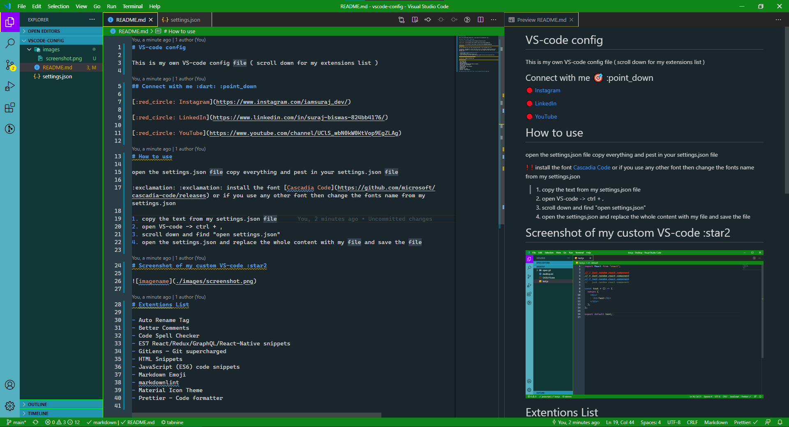
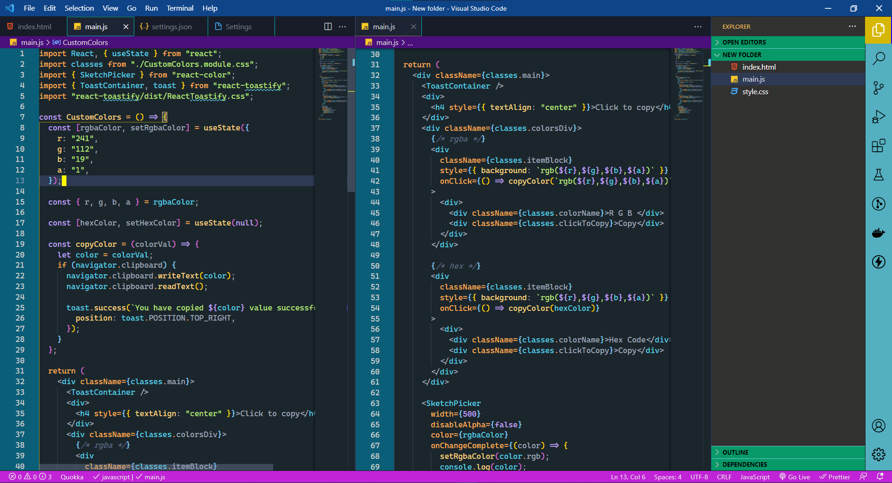

# VS-code config

This is my own VS-code config file ( scroll down for my extensions list )

## Connect with me :dart: :point_down

[:red_circle: Instagram](https://www.instagram.com/iamsuraj_dev/)

[:red_circle: LinkedIn](https://www.linkedin.com/in/suraj-biswas-824bb4176/)

[:red_circle: Tweeter](https://twitter.com/iamsuraj_dev)

# How to use

open the settings.json file copy everything and pest in your settings.json file

:exclamation: :exclamation: install the font [Cascadia Code](https://github.com/microsoft/cascadia-code/releases) or if you use any other font then change the fonts name from my settings.json

1. copy the text from my settings.json file
2. open VS-code -> ctrl + ,
3. scroll down and find "open settings.json"
4. open the settings.json and replace the whole content with my settings.json file and save it

# Screenshot of my custom VS-code 🌟

## Green Demon :jack_o_lantern: ( [Link](https://github.com/iamsurajdev/vscode-config/tree/green-demon) )

## Eye Candy 🍬 ( [Link](https://github.com/iamsurajdev/vscode-config/tree/eye-candy) )

# Extentions That I Use ⬇️

- :emojisense:
- advanced-new-file
- Auto Rename Tag
- Awesome Flutter Snippets
- Better Comments
- Bracket Pair Colorizer
- Code Spell Checker
- Color Highlight
- css-auto-prefix
- Dart
- Debugger for Chrome
- Docker
- ES7 React/Redux/GraphQL/React-Native snippets
- File Utils
- Flutter
- GitLens — Git supercharged
- Halcyon Theme
- JavaScript (ES6) code snippets
- Jupyter
- Live Server
- markdownlint
- Material Icon Theme
- Material-UI Snippets
- Next.js snippets
- Night Owl
- Prettier - Code formatter
- Pylance
- Python
- Quokka.js
- Sass
- Svg Preview
- Thunder Client
- Visual Studio IntelliCode

## Please give this repo a star :star: it will motivate me more thank you
